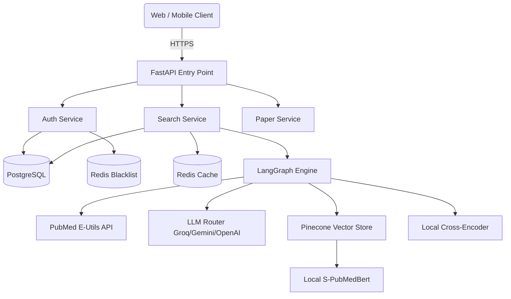
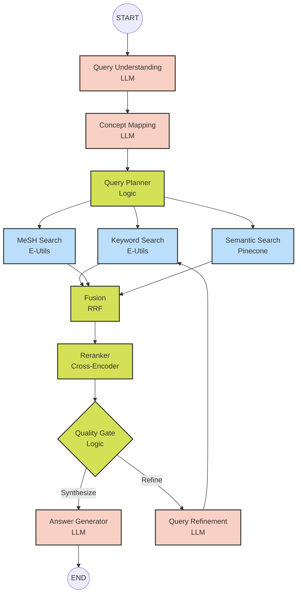

# PubMedIQ Backend 🧬


PubMedIQ is an advanced, AI-powered biomedical literature research assistant. It leverages a multi-agent **LangGraph** pipeline to execute hybrid searches (Keyword + MeSH + Semantic) over the PubMed database, re-ranking and synthesizing results to provide evidence-grounded answers.

---

## Table of Contents
- [Project Overview](#project-overview)
- [Problem Statement](#problem-statement)
- [Solution](#solution)
- [Architecture](#architecture)
- [Technology Stack](#technology-stack)
- [Folder Structure](#folder-structure)
- [Installation](#installation)
- [Environment Variables](#environment-variables)
- [Setup & Configuration](#setup--configuration)
  - [Database Setup](#database-setup)
  - [Redis Setup](#redis-setup)
  - [Pinecone Setup](#pinecone-setup)
  - [PubMed Configuration](#pubmed-configuration)
  - [LLM Configuration](#llm-configuration)
  - [LangSmith Setup](#langsmith-setup)
- [Running Locally](#running-locally)
- [Docker Setup](#docker-setup)
- [API Documentation](#api-documentation)
- [Authentication](#authentication)
- [Search Workflow & LangGraph Architecture](#search-workflow--langgraph-architecture)
- [Evaluation & Testing](#evaluation--testing)
- [Deployment](#deployment)
- [Security](#security)
- [Future Improvements](#future-improvements)

---

## Project Overview

PubMedIQ empowers biomedical researchers, clinicians, and students to find highly relevant literature and synthesize evidence. Instead of simple keyword matching, PubMedIQ interprets research intent, queries PubMed and a local vector database in parallel, fuses the results, re-ranks them using cross-encoders, and generates a cited synthesis of the findings.

## Problem Statement

Traditional biomedical search engines like PubMed rely heavily on exact keyword matching and Boolean operators. This presents several challenges:
1. **Vocabulary Gap:** Researchers may use synonyms that miss important papers.
2. **Information Overload:** Queries often return thousands of papers, making synthesis difficult.
3. **Lack of Context:** Standard search doesn't extract the actionable clinical or scientific insights across multiple papers.
4. **Iterative Burden:** Users must manually refine queries multiple times to find the right evidence.

## Solution

PubMedIQ solves these problems by:
1. **Query Understanding:** Using LLMs to map natural language to structured PICO (Population, Intervention, Comparison, Outcome) frameworks and MeSH terms.
2. **Hybrid Retrieval:** Searching PubMed (Keyword + MeSH) and a semantic Pinecone vector index simultaneously.
3. **Automated Synthesis:** Using LLMs to read the abstracts of the top-ranked papers and generate a synthesized, evidence-grounded answer with PMIDs cited for every factual claim.
4. **Self-Refinement:** Using a Quality Gate to automatically refine the search query if the initial results are poor.

---

## Architecture



## Technology Stack

- **Framework:** FastAPI (Python 3.11)
- **Database:** PostgreSQL 16 (asyncpg) + SQLAlchemy 2.0 + Alembic
- **Caching & Sessions:** Redis 7
- **Vector Store:** Pinecone
- **Agent Orchestration:** LangGraph & LangChain
- **LLM Routing:** Groq (primary), Google Gemini, OpenAI (fallbacks)
- **Embeddings:** `pritamdeka/S-PubMedBert-MS-MARCO` (HuggingFace, Local)
- **Reranker:** `cross-encoder/ms-marco-MiniLM-L-6-v2` (HuggingFace, Local)
- **Security:** JWT (Access/Refresh), Argon2id (OWASP params)
- **Containerization:** Docker & Docker Compose

---

## Folder Structure

A strict modular monolith architecture is enforced.

```text
pubmediq-backend/
├── alembic.ini                  # Database migration config
├── pyproject.toml               # Project metadata & tooling
├── requirements.txt             # Dependencies
├── app/
│   ├── main.py                  # FastAPI application entry point
│   ├── api/                     # API routers (Layer 9)
│   ├── application/             # Application services (Layer 8)
│   ├── agents/                  # LangGraph orchestrator (Layer 7)
│   ├── schemas/                 # Pydantic models (Layer 6)
│   ├── domain/                  # Domain entities & enums (Layer 5)
│   ├── infrastructure/          # External connections (Layer 2-4)
│   │   ├── database/            # PostgreSQL, SQLAlchemy models, Repositories
│   │   ├── security/            # Argon2, JWT, Redis Blacklist
│   │   ├── pubmed/              # NCBI E-Utils HTTP Client
│   │   ├── vectorstore/         # Pinecone & Local Embeddings
│   │   ├── llm/                 # Model router & fallback logic
│   │   └── cache/               # Redis service
│   ├── core/                    # Settings, Exceptions, Logging (Layer 1)
│   └── observability/           # LangSmith integration (Layer 10)
├── deployment/                  # Dockerfiles & Compose files
└── scripts/                     # CLI tasks (seed DB, ingest PubMed, etc.)
```

---

## Installation

**1. Clone the repository**
```bash
git clone https://github.com/yourusername/pubmediq-backend.git
cd pubmediq-backend
```

**2. Set up Python environment**
```bash
python -m venv venv
source venv/bin/activate  # On Windows: venv\Scripts\activate
pip install -r requirements.txt
```

---

## Environment Variables

Copy the example file to create your local `.env`:
```bash
cp .env.example .env
```

The application relies on several API keys (minimum requirement: `GROQ_API_KEY` for LLMs and `PINECONE_API_KEY` for vector search). 

---

## Setup & Configuration

### Database Setup
The app requires PostgreSQL. You can run it via Docker:
```bash
docker compose -f deployment/docker-compose.yml up -d postgres
```
Create the tables and seed a test user (`test@pubmediq.com` / `testpassword123`):
```bash
python scripts/seed_database.py --seed
```

### Redis Setup
Redis is used for caching, session state, and JWT blacklisting.
```bash
docker compose -f deployment/docker-compose.yml up -d redis
```

### Pinecone Setup
Set your `PINECONE_API_KEY` in `.env`.
Initialize the Pinecone index (dimension 768, cosine metric):
```bash
python scripts/create_index.py
```

### PubMed Configuration
PubMed's API (E-Utils) limits anonymous users to 3 requests/second. 
To increase this to 10 requests/second, obtain an API key from NCBI and set `NCBI_API_KEY` and `NCBI_EMAIL` in `.env`.

### LLM Configuration
PubMedIQ uses a Model Router that falls back gracefully:
1. **Groq** (`llama-3.1-8b-instant`) - Free tier, incredibly fast.
2. **Google Gemini** (`gemini-1.5-flash`) - Excellent context window.
3. **OpenAI** (`gpt-4o-mini`) - Fallback.

Set `DEFAULT_LLM_PROVIDER=groq` and provide the `GROQ_API_KEY`.

### LangSmith Setup
For visual debugging of the LangGraph pipeline:
1. Set `LANGCHAIN_TRACING_V2=true`
2. Provide `LANGCHAIN_API_KEY` and `LANGCHAIN_PROJECT`.

---

## Running Locally

To run the FastAPI server with hot-reloading:
```bash
uvicorn app.main:app --reload --port 8000
```
Swagger UI will be available at: [http://localhost:8000/docs](http://localhost:8000/docs)

---

## Docker Setup

To run the entire stack (API, PostgreSQL, Redis) via Docker Compose:

```bash
docker compose -f deployment/docker-compose.yml up -d --build
```
The API will be exposed on port `8000`.

---

## API Documentation

Interactive API documentation is automatically generated by FastAPI:
- **Swagger UI**: `/docs`
- **ReDoc**: `/redoc`

Key endpoints:
- `POST /api/v1/search` - Run the hybrid research pipeline
- `POST /api/v1/research/summarize` - Summarize multiple papers
- `POST /api/v1/papers/{pmid}/save` - Bookmark a paper
- `GET /api/v1/history` - View past searches

---

## Authentication

Authentication is handled via JWT Access and Refresh tokens.
- **Login:** Returns `access_token` (30 mins) and `refresh_token` (7 days).
- **Format:** `Authorization: Bearer <token>`
- **Logout:** Adds the token's JTI to a Redis blacklist.

Passwords are hashed using **Argon2id** (via `argon2-cffi`), configured with OWASP 2024 recommended parameters (64MB memory, 3 iterations).

---

## Search Workflow & LangGraph Architecture

The core of PubMedIQ is its 11-node LangGraph StateGraph.



1. **Parallel Retrieval**: Keyword, MeSH, and Semantic searches run concurrently.
2. **Reciprocal Rank Fusion (RRF)**: A parameter-free algorithm merges results from all three sources.
3. **Cross-Encoder Reranking**: The `ms-marco-MiniLM-L-6-v2` model evaluates the actual relevance of the query to the fetched abstracts.
4. **Quality Gate**: If the average top-K relevance score falls below `0.65`, the system routes to a Refinement node to rewrite the query and try again (max 2 loops).

---

## Evaluation & Testing

The backend is built for testability.
- **Unit Tests:** Run with `pytest tests/unit`
- **Integration Tests:** Run with `pytest tests/api`
- **Agent Evaluation:** The system can be evaluated using LangSmith datasets to measure precision, recall, and synthesis accuracy.

---

## Deployment

The provided `Dockerfile` uses a multi-stage build to ensure a small attack surface and image size. It creates a dedicated non-root user `pubmediq` and sets appropriate permissions.

**Production Checklist:**
- [ ] Set `APP_ENV=production` and `DEBUG=False`.
- [ ] Provide strong, randomly generated `SECRET_KEY` and `JWT_SECRET_KEY`.
- [ ] Expose behind a reverse proxy (e.g., Nginx) with TLS termination.
- [ ] Apply Alembic migrations against the production database.

---

## Security

- **OWASP Compliance:** Passwords hashed with Argon2id.
- **Token Blacklisting:** Redis-backed token revocation prevents reuse of logged-out access tokens.
- **Injection Prevention:** SQLAlchemy ORM prevents SQL injection. Parameterized API clients prevent command injection.
- **Least Privilege:** Docker container runs as a non-root user.

---

## Future Improvements

1. **Background Tasks (Celery):** Move long-running ingestion workflows to background workers.
2. **GraphRAG:** Incorporate a knowledge graph (e.g., Neo4j) mapping Authors, Institutions, and MeSH terms for advanced discovery.
3. **Full-Text PDFs:** Integrate with PubMed Central Open Access to parse full-text PDFs instead of just abstracts.
4. **User Subscriptions:** Add Stripe billing integration for advanced API usage limits.

---
*Built with ❤️ for biomedical innovation.*
