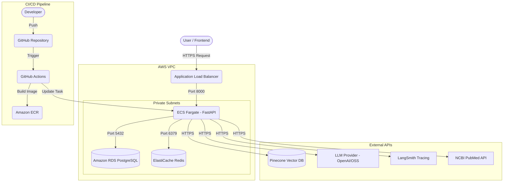

# 🚀 PubMedIQ AWS Deployment Architecture & CI/CD Guide

This guide outlines a production-ready, scalable architecture for deploying the PubMedIQ backend to AWS, incorporating your full technology stack (FastAPI, PostgreSQL, Redis, Pinecone, and LLM endpoints).

## 1. 🏗️ Architecture Overview

For a modern, async FastAPI application running long LangGraph research tasks, the recommended architecture is **Containerized Compute using Amazon ECS (Fargate)**. 

### Architecture Diagram

### Components
1. **Amazon ECS (Fargate)**: Runs your FastAPI app in Docker containers. Fargate manages the underlying servers automatically.
2. **Amazon RDS (PostgreSQL)**: Fully managed, highly available relational database for `search_history` and `users`.
3. **Amazon ElastiCache (Redis)**: Managed in-memory data store for your cache service and search session states.
4. **Application Load Balancer (ALB)**: Routes incoming traffic from the internet to your ECS containers.
5. **Amazon ECR**: Docker container registry to store your built application images.
6. **AWS Secrets Manager**: Securely stores your `.env` variables (Database passwords, Pinecone API keys, LLM keys).

---

## 2. 🚀 CI/CD Pipeline (GitHub Actions)

Your GitHub Actions pipeline will automate the testing, building, and deployment of your application.

### Pipeline Workflow (`.github/workflows/deploy.yml`)

1. **Test Phase (Continuous Integration)**:
   - Triggers on PR or push to `main`.
   - Sets up Python, installs dependencies via `uv` or `pip`.
   - Runs `pytest` suite.
2. **Build Phase**:
   - Authenticates with AWS (using OIDC securely, no long-lived keys).
   - Builds the Docker image.
   - Pushes the image to **Amazon ECR**.
3. **Deploy Phase (Continuous Deployment)**:
   - Downloads the current ECS Task Definition.
   - Injects the new Docker image URI.
   - Deploys the updated Task Definition to the ECS Cluster.
   - Runs Alembic migrations (`alembic upgrade head`) via a separate ECS run-task or during container startup.

---

## 3. 🛠️ Execution Plan: How we will build this

If you approve this architecture, we will proceed with the implementation in the following steps:

> [!IMPORTANT]
> **User Feedback Required**
> Do you want to proceed with creating the necessary files (Docker, GitHub Actions) for this architecture?
> Do you prefer provisioning the AWS resources manually via the AWS Console, or would you like me to write Infrastructure as Code (Terraform / AWS CDK) for you?

### Step 1: Dockerization (Next Action)
- Create a production-ready `Dockerfile` optimized for FastAPI and Python.
- Create a `.dockerignore`.
- Create a `docker-compose.yml` for local testing of the production image.

### Step 2: CI/CD Setup
- Create the `.github/workflows/deploy.yml` pipeline file.
- Document exactly which GitHub Secrets you need to set (e.g., `AWS_ROLE_ARN`, `ECR_REPOSITORY`).

### Step 3: Database Migration Strategy
- Create a `start.sh` entrypoint script for Docker.
- The script will automatically run `alembic upgrade head` before starting `uvicorn`, ensuring the RDS database is always up-to-date upon deployment.

### Step 4: AWS Provisioning Checklist
- I will provide you with a step-by-step checklist to configure the VPC, RDS, ElastiCache, ECR, and ECS inside your AWS account.

---
## 💬 Open Questions for You

1. **Domain & SSL**: Do you have a domain name ready for this backend (e.g., `api.pubmediq.com`), or will you use the raw ALB URL for now?
2. **Cost Considerations**: Fargate, RDS, and ElastiCache run continuously. Are you okay with standard AWS costs (~$30-50/month minimum for small instances), or do you need a budget-friendly EC2 single-instance alternative?
3. **Infrastructure as Code**: Should I generate Terraform scripts to automate the AWS setup, or provide a UI Console click-guide?
